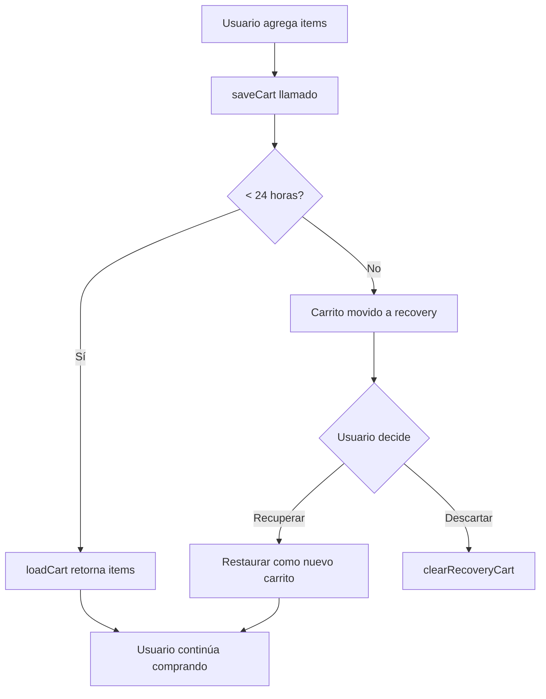

# CartService - Sistema de Persistencia del Carrito 🛒

Servicio de gestión del carrito de compras con persistencia automática y sistema de recuperación.

## 📋 Características

- ✅ **Persistencia automática** - SharedPreferences (web + mobile)
- ✅ **Expiración inteligente** - 24 horas con recovery cart
- ✅ **Validación de tienda** - Evita conflictos entre stores
- ✅ **Recovery system** - Recupera carritos expirados
- ✅ **Métodos helper** - hasValidCart(), getCartAge(), etc.

## 🚀 Uso Básico

### 1. Guardar carrito

```dart
final cartService = CartService();

await cartService.saveCart(
  items: {
    'prod123': {'name': 'Pizza', 'price': 12.99, 'quantity': 2},
    'prod456': {'name': 'Refresco', 'price': 2.50, 'quantity': 1},
  },
  storeId: 'store_abc',
  total: 28.48,
);
```

### 2. Cargar carrito

```dart
final cart = await cartService.loadCart();

if (cart != null) {
  // Carrito válido (< 24h)
  final items = cart['items'] as Map<String, dynamic>;
  final storeId = cart['storeId'] as String;
  final total = cart['total'] as double;
  
  print('Carrito cargado: ${items.length} items');
} else {
  // No hay carrito o expiró
  print('Sin carrito activo');
}
```

### 3. Verificar carrito expirado

```dart
final recoveryCart = await cartService.getRecoveryCart();

if (recoveryCart != null) {
  // Mostrar diálogo: ¿Recuperar carrito anterior?
  showRecoveryDialog(recoveryCart);
}
```

### 4. Limpiar carrito

```dart
// Limpiar carrito activo
await cartService.clearCart();

// Limpiar carrito de recovery
await cartService.clearRecoveryCart();

// Limpiar todo (activo + recovery)
await cartService.clearAll();
```

## 🔍 Métodos Auxiliares

### hasValidCart()

Verifica si existe un carrito válido (sin cargarlo).

```dart
final hasCart = await cartService.hasValidCart();
if (hasCart) {
  print('Hay carrito guardado');
}
```

### hasRecoveryCart()

Verifica si existe un carrito de recuperación.

```dart
final hasRecovery = await cartService.hasRecoveryCart();
if (hasRecovery) {
  // Mostrar badge "Carrito anterior disponible"
}
```

### getCartAge()

Obtiene la antigüedad del carrito actual.

```dart
final age = await cartService.getCartAge();
if (age != null) {
  print('Carrito guardado hace ${age.inHours} horas');
}
```

### getCartSummary()

Resumen rápido sin cargar items completos.

```dart
final summary = await cartService.getCartSummary();
if (summary != null) {
  print('${summary.itemCount} items - \$${summary.total}');
}
```

## 🔄 Flujo de Expiración



## 📦 Estructura de Datos

### Formato del carrito guardado

```json
{
  "items": {
    "productId1": {
      "name": "Producto 1",
      "price": 19.99,
      "quantity": 2
    },
    "productId2": {
      "name": "Producto 2",
      "price": 9.99,
      "quantity": 1
    }
  },
  "storeId": "store_123",
  "total": 49.97,
  "timestamp": "2026-02-22T14:30:00.000Z"
}
```

## 🎯 Ejemplo Completo - ClientCatalogPage

```dart
class _ClientCatalogPageState extends State<ClientCatalogPage> {
  final _cartService = CartService();
  Map<String, Map<String, dynamic>> _cart = {};

  @override
  void initState() {
    super.initState();
    _loadCartFromStorage();
  }

  Future<void> _loadCartFromStorage() async {
    // 1. Intentar cargar carrito activo
    final cart = await _cartService.loadCart();
    
    if (cart != null && cart['storeId'] == widget.storeId) {
      // Carrito válido encontrado
      setState(() {
        _cart = Map<String, Map<String, dynamic>>.from(
          cart['items'] as Map<String, dynamic>,
        );
      });
      
      _showToast('Carrito retomado: ${_cart.length} items');
      return;
    }

    // 2. Si no hay carrito activo, verificar recovery
    final recovery = await _cartService.getRecoveryCart();
    
    if (recovery != null && recovery['storeId'] == widget.storeId) {
      _showRecoveryDialog(recovery);
    }
  }

  Future<void> _saveCartToStorage() async {
    if (_cart.isEmpty) {
      await _cartService.clearCart();
      return;
    }

    final total = _cart.values.fold<double>(0, (sum, item) {
      return sum + ((item['price'] as double) * (item['quantity'] as int));
    });

    await _cartService.saveCart(
      items: _cart,
      storeId: widget.storeId,
      total: total,
    );
  }

  void _showRecoveryDialog(Map<String, dynamic> recovery) {
    showDialog(
      context: context,
      builder: (context) => AlertDialog(
        title: Text('🛒 Carrito Anterior'),
        content: Text(
          'Encontramos un carrito con ${recovery['items'].length} productos.\n'
          '¿Deseas recuperarlo?'
        ),
        actions: [
          TextButton(
            onPressed: () async {
              await _cartService.clearRecoveryCart();
              Navigator.pop(context);
            },
            child: Text('Descartar'),
          ),
          ElevatedButton(
            onPressed: () async {
              // Restaurar carrito
              setState(() {
                _cart = Map<String, Map<String, dynamic>>.from(
                  recovery['items'] as Map<String, dynamic>,
                );
              });
              
              await _saveCartToStorage();
              await _cartService.clearRecoveryCart();
              
              Navigator.pop(context);
              _showToast('Carrito recuperado');
            },
            child: Text('Recuperar'),
          ),
        ],
      ),
    );
  }
}
```

## 🧪 Testing

```dart
// Simular carrito expirado (para testing)
test('Cart expires after 24 hours', () async {
  final service = CartService();
  
  // Guardar carrito
  await service.saveCart(
    items: {'test': {'name': 'Test', 'price': 1.0, 'quantity': 1}},
    storeId: 'store1',
    total: 1.0,
  );
  
  // Simular paso de 25 horas (modificar timestamp manualmente)
  // ...
  
  // Verificar que loadCart() retorna null
  final cart = await service.loadCart();
  expect(cart, isNull);
  
  // Verificar que existe recovery
  final hasRecovery = await service.hasRecoveryCart();
  expect(hasRecovery, isTrue);
});
```

## ⚙️ Configuración

### Cambiar tiempo de expiración

Editar `cart_service.dart`:

```dart
class CartService {
  static const Duration _cartExpiration = Duration(hours: 48); // 48h en lugar de 24h
}
```

### Personalizar claves de storage

```dart
class CartService {
  static const String _cartKey = 'mi_app_cart'; // Personalizado
  static const String _cartRecoveryKey = 'mi_app_cart_recovery';
}
```

## 📊 Performance

- **saveCart()**: ~5-10ms (serialización JSON)
- **loadCart()**: ~5-10ms (parsing + validación)
- **hasValidCart()**: ~3-5ms (solo lectura de clave)
- **getCartAge()**: ~5ms (parse timestamp)

## 🔐 Seguridad

⚠️ **Nota**: Los datos se guardan en texto plano en SharedPreferences.

Para datos sensibles, considerar:
- Encriptar JSON antes de guardar
- No guardar información de pago
- Validar integridad al cargar

## 🐛 Debugging

```dart
// Ver todos los datos del carrito
final prefs = await SharedPreferences.getInstance();
print('Cart: ${prefs.getString('mapper_cart')}');
print('Recovery: ${prefs.getString('mapper_cart_recovery')}');

// Limpiar todo para testing
await cartService.clearAll();
```

## 📝 Changelog

### v1.2 (22 Feb 2026)
- ✅ Sistema de expiración y recovery implementado
- ✅ Migrado a SharedPreferences (web + mobile)
- ✅ Métodos helper: hasRecoveryCart(), getCartAge()
- ✅ Método clearAll() para limpieza completa

### v1.1 (22 Feb 2026)
- ✅ Integración en ClientCatalogPage
- ✅ Persistencia automática en add/remove
- ✅ Clear en checkout

### v1.0 (22 Feb 2026)
- ✅ Implementación inicial con métodos básicos
- ✅ Estructura de datos y CartSummary
- ✅ Extension CartExtension
